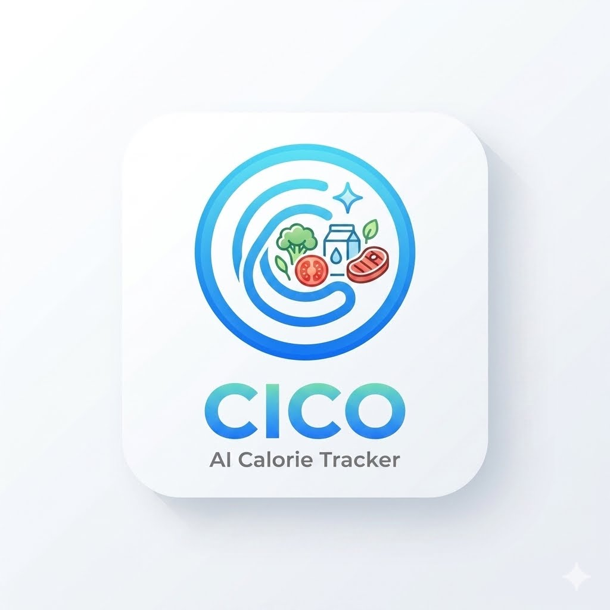
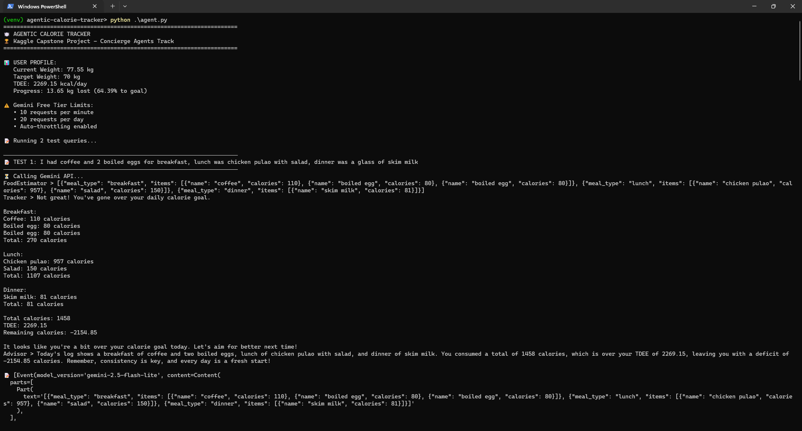
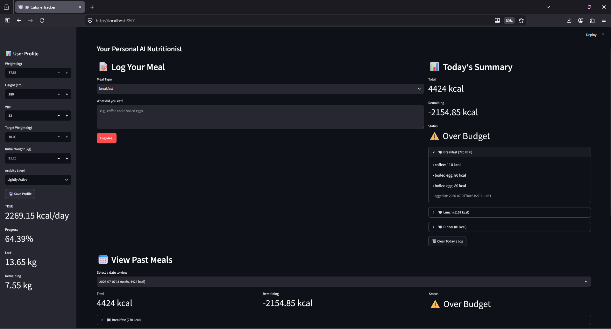

# Agentic Calorie Tracker
Your Personal AI Nutritionist - A multi-agent system for intelligent calorie tracking and health management.

## Capstone Project - Concierge Agents Track

This project demonstrates a rudimentary AI agent system built with Google's Agent Development Kit (ADK) that helps users track their daily calorie intake using natural language.

## Problem Statement

People struggle to track their daily calorie intake consistently because:

- Manual logging is tedious and time-consuming
- Estimating calories requires nutritional knowledge
- Most apps require exact food matching
- Lack of personalized, contextual advice

## Solution

An AI-powered calorie tracking assistant that:

- Accepts natural language meal descriptions
- Automatically estimates calories using Gemini's nutritional knowledge
- Tracks daily totals against personalized TDEE
- Provides intelligent swap suggestions
- Shows progress toward weight goals
- Uses multi-agent architecture for reliable, scalable tracking

##  Architecture

```
┌─────────────────────────────────────────────────────────────┐
│                    USER INPUT                               │
│         "I had coffee and 2 boiled eggs"                    │
└─────────────────────────────────────────────────────────────┘
                              ↓
┌─────────────────────────────────────────────────────────────┐
│              PARALLEL PROCESSING                            │
│  ┌────────────────────┐  ┌─────────────────────────────┐    │
│  │  Food Estimator    │  │  Query Classifier           │    │
│  │  (LLM Agent)       │  │  (LLM Agent)                │    │
│  └────────────────────┘  └─────────────────────────────┘    │
└─────────────────────────────────────────────────────────────┘
                              ↓
┌─────────────────────────────────────────────────────────────┐
│                    TRACKER AGENT                            │
│              (Function Tools + LLM)                         │
└─────────────────────────────────────────────────────────────┘
                              ↓
┌─────────────────────────────────────────────────────────────┐
│                    ADVISOR AGENT                            │
│              (LLM + Tools)                                  │
└─────────────────────────────────────────────────────────────┘
                              ↓
┌─────────────────────────────────────────────────────────────┐
│                 USER RESPONSE                               │
│  "Logged breakfast: 270 kcal. Daily total: 270/2300.        │
│   Remaining: 2030 kcal. Great start! "                      │
└─────────────────────────────────────────────────────────────┘
```

## Key Concepts Demonstrated

- **Multi-Agent System** (ADK) - Sequential, Parallel, and Loop agents
- **Function Tools** - Custom Python functions as agent tools
- **Agent Tools** - Agents calling other agents
- **Security Features** - No hardcoded API keys, local data storage
- **Deployability** - Runs locally, in Kaggle, or Streamlit
- **Agent Skills** - ADK CLI tools (create, run, web)

## Quick Start

### Prerequisites

- Python 3.11+
- Gemini API Key (get from [Google AI Studio](https://aistudio.google.com/app/api-keys))

### Installation

```bash
# Clone the repository
git clone https://github.com/yourusername/calorie-tracker-agent.git
cd calorie-tracker-agent

# Create virtual environment
python -m venv venv
source venv/bin/activate  # On Windows: venv\Scripts\activate

# Install dependencies
pip install -r requirements.txt

# Set up API key
cp .env.example .env
# Edit .env and add your Gemini API key
```

### Running the Agent

```bash
# Run the main agent demo
python agent.py

# Run the Streamlit UI
streamlit run ui/app.py
```

## Demo Output
```
 AGENTIC CALORIE TRACKER
 Kaggle Capstone Project - Concierge Agents Track
======================================================================

 USER PROFILE:
   Current Weight: 77.55 kg
   Target Weight: 70 kg
   TDEE: 2300 kcal/day
   Progress: 13.65 kg lost (86.76% to goal)

──────────────────────────────────────────────────────────────────────
 TEST 1: I had coffee and 2 boiled eggs for breakfast
──────────────────────────────────────────────────────────────────────

 Logged breakfast: 270 kcal. Daily total: 270/2300. 
    Remaining: 2030 kcal. Great start! 
```








## Project Structure

```
calorie-tracker-agent/
├── agent.py                 # Main agent implementation
├── agents/                  # Specialized agents
│   ├── __init__.py
│   ├── food_estimator.py
│   ├── tracker.py
│   └── advisor.py
├── tools/                   # Function tools
│   ├── __init__.py
│   ├── calorie_tools.py
│   ├── tracking_tools.py
│   └── analytics_tools.py
├── data/                    # Data storage
│   ├── user_profile.json
│   └── daily_log.json
├── ui/                      # Streamlit interface
│   └── app.py
├── notebooks/               # Demo notebooks
│   └── demo.ipynb
├── requirements.txt
├── .env.example
└── README.md
```

## Security

This project handles your personal data securely:

- API keys stored in `.env` (not committed to git)
- All user data stored locally in JSON files
- No cloud upload or third-party data sharing
- `.env` file is in `.gitignore` to prevent accidental commits
- No hardcoded secrets in code

### Setting Up API Key

1. Get your Gemini API key from [Google AI Studio](https://aistudio.google.com/app/api-keys)
2. Copy `.env.example` to `.env`:
   ```bash
   cp .env.example .env
   ```
3. Edit `.env` and add your API key:
   ```
   GOOGLE_API_KEY=your_actual_api_key_here
   ```

## Technology Stack

- **Framework**: Google ADK (Agent Development Kit)
- **LLM**: Gemini 2.5 Flash Lite
- **UI**: Streamlit
- **Language**: Python 3.11+
- **Data Storage**: Local JSON files

## Future Enhancements

- [ ] MCP Server integration with fitness trackers (Fitbit, Apple Health)
- [ ] Recipe suggestions based on remaining calories
- [ ] Export data to CSV/Excel
- [ ] Meal planning recommendations
- [ ] Nutrition breakdown (protein, carbs, fat)

## License

MIT License - See LICENSE file for details

## Author

Your Name
- GitHub: [@edmund-carvalho](https://github.com/edmund-carvalho)
- LinkedIn: [edmund-carvalho](https://www.linkedin.com/in/edmundcarvalho/)

## Acknowledgments

- Google Agent Development Kit (ADK)
- Kaggle 5-Day AI Agents Course
- Gemini API
- Streamlit

## Support

If you find this project useful, please give it a star!


## **Disclaimer:** 
This project is for educational and demonstration purposes only. It is not a health, medical, or dietary advice tool. Always consult qualified professionals for health decisions.